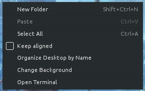
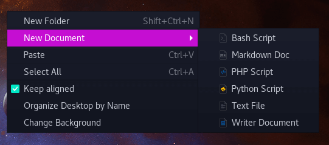

# Right-click New File Context Menu for Nautilus / Nemo / Gnome File Manager
Super easy and light script to automate adding a context menu to Nautilus / Gnome Files to create a new document.

Although this script was originally built for a now-ancient version of Nautilus, it still works for current versions of Nautilus *and* Nemo file managers, as late as GNOME Shell 3.38.3

***

Before:



After:



### Default Menu Options
- Bash Script
- PHP Script
- Text File
- Libre Office Word Document
- Markdown Document

Any menu item ins interchangeable and can be removed.

## Download the automation script
Run via terminal:
```bash
git clone https://github.com/angela-d/nautilus-right-click-new-file.git && cd nautilus-right-click-new-file
```
Confirm you're in the right directory:
```bashrc
ls
```
You should see:
```html
img  LICENSE  automate.sh  README.md  Templates.tar.gz
```

Now, run the script:
```bashrc
./automate.sh
```

If you've already used this and want to update to get the Markdown Document automagically installed, update your git repo or do a fresh clone and follow the above steps.

Updating:


That's all there is to it!

***

# (optional) Manual Instructions
## (if you don't want to run the automated script)
* Download Templates.tar.gz and extract
```bash
tar -xvzf Templates.tar.gz
```
* Move the extracted files (templates) into /home/youruser/Templates/

(in Nautilus; Open File Manager -> Click Home on the left -> If *Templates* folder does not exist, create it. If you're using a non-english language, change the name accordingly, e.g. */home/youruser/Vorlagen/* in a german environment. Creating *~/Templates/* in a non-english environment won't have any effect.)

* If your changes to do not automatically appear, log out or run:
```bash
xdg-user-dirs-update
```
to generate the user-dirs config file.

Done!

## Note
Each of the template files have a prefix like `#!/bin/bash` or `<?php` when you open the file (except the Text file & Writer/Word .doc) - while standard for the script type in question, it is also used so the operating system could interpret the type of file and automatically create the context menu icon without any extra code.

***

#### (optional) Customize your Context Menu ####
In Nautilus, navigate to the Home directory and then Templates.

In the **Templates** directory, you can place your dummy files (templates) in folders for easy sorting, or add new ones.

If your changes are not instantaneous, restart Nautilus:
```bash
nautilus -q && nautilus &
```
In some instances, you may have to log out and log back in.
